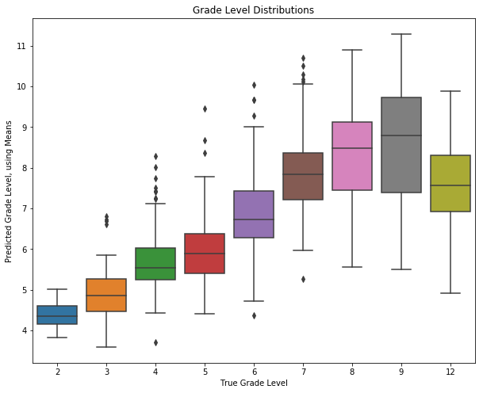
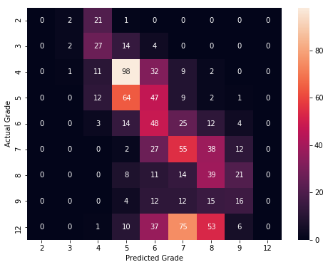
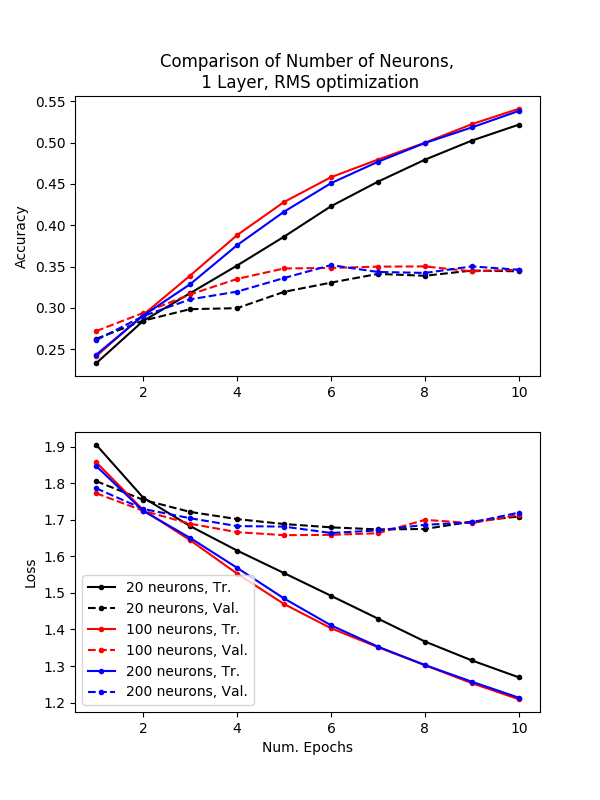
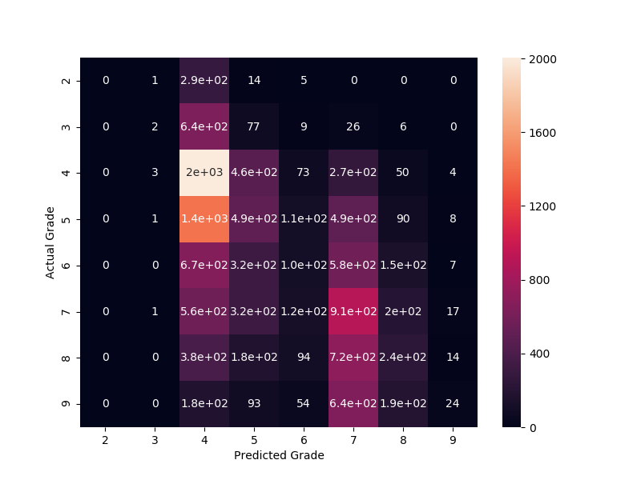
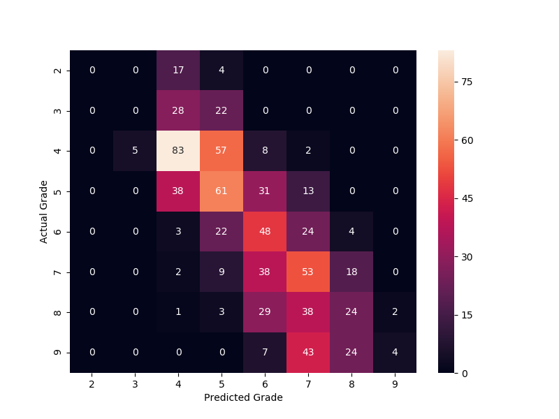

# autograder
Automatic grade level complexity classifier.

We explored 3 different models, as follows.

## Kneser-Ney Smoothing
To use `article_process.py`, you will need to install from: https://github.com/kpu/kenlm.

To instantiate the object, you will need the paths to:
- the folder with the text data
- the path to where you installed kenlm via git
- the subpath to the language models:
```python
path_to_data = 'path/to/data'
path_to_kenlm = 'path/to/github/kenlm'
path_to_arpa = path_to_kenlm + '/lm'
```

#### Usage:

In the following example, 5 denotes 5-gram, you are creating grade level models, and original articles are not used.
```python
from article_lm import ArticleLM
articleLM = ArticleLM(path_to_data,
                      path_to_kenlm,
                      path_to_arpa, 5, 'grade_level', False)
articleLM.build_data()
articleLM.train_all_arpas()
article_val_df, means_val = articleLM.compute_article_best_guess('val')
articleLM.plot_article_best_grade_levels(means_val)
(grade_level_cm, raw_accuracy, banded_accuracy,
 binary_cm, binary_accuracy, binary_f1) = articleLM.compute_scores_grade_level(means_val)
 
 
print("accuracy", binary_accuracy)
print("error", 1-binary_accuracy)
print("f1", binary_f1)
```
#### Outputs:
```
accuracy 0.8469
error 0.15305
f1 0.8843
```

Both of the following plots shows results for the Kneser-Ney N-gram Smoothing approach, using all available articles.
They use the mean to predict a grade level for the entire article, after predicting each sentence grade level. 



This plots represents a distribution of predicted grade levels per article, plotted against true grade levels.

Another representation of the test results is this confusion matrix:


## RNN
For training the RNN, run the following 2 files:
```python
data_process.py
train_model_gce_REG.py
```

Note that the RNN must be run on a GPU with Tensorflow 1.13 (other versions have different keras functions implemented) and Keras.

The script will run through varying combinations of L1 and L2 regularizations on the input, bias and recurrent 
weights of the LSTM 1-layer model. Note that the script can be run on both binary and multiclass datasets. Also note that 
the model is fixed with only 1 LSTM layer with 100 neurons but this can easily be modified for more layers and neurons.
All run history is logged and saved.

An example of a training run showing a comparison of the number of neurons per layer:


Note the low validation accuracy and increasingly validation loss indicating that the RNN is overfit.

## Naive Bayes
For training the Naive Bayes (NB) classifier plus added linear classifier:
```python
NB_classifier_v5.py
```

This script will run through several different combinations of settings including:
- numbers of sentences in each text segment chunk
- maxmimum number of n-grams
- inclusion (or not) of the original articles
- binary and multi-class (grade-level) classification

For each combination, if the text segments are smaller than an entire article, the script will train a secondary linear classifier.
The linear classifiers take the NB predictions for the individual segments and aggregate them into a prediction for the 
entire articles. The linear classifiers explored include:
- mean
- median
- logistic regression
- linear regression

For each combination, the train accuracy, test accuracy, and test f1 score are reported. All results are saved to file.
An example of the output of the raw NB classifier for the multiclass case is shown below via a confusion matrix:



Note that the NB classifier is adept at distinguishing between "easy" versus "hard" articles. The NB predictions are then fed into a secondary classifier. An example of the resulting predictions after the NB predictions are fed into a linear regression are shown below:



Note that the secondary classifier acts to "smooth" out the two NB clusters of "easy" and "hard" articles.
